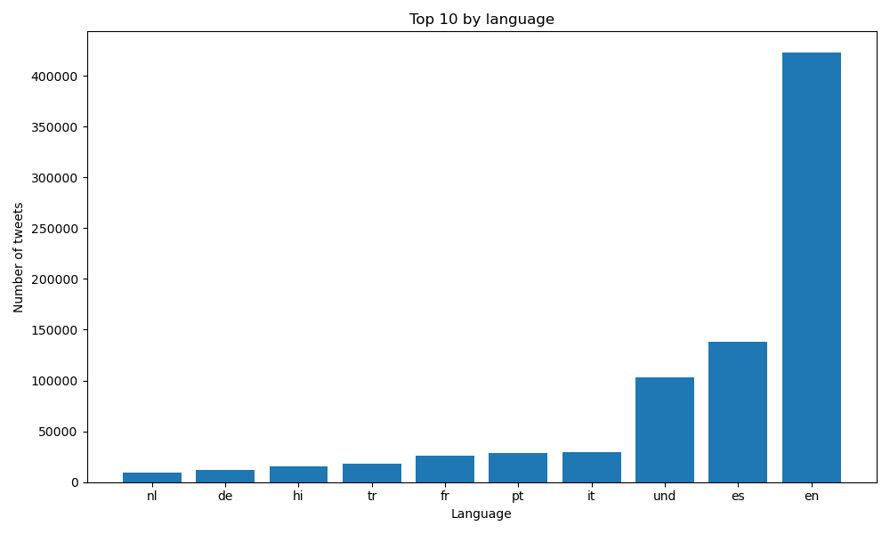
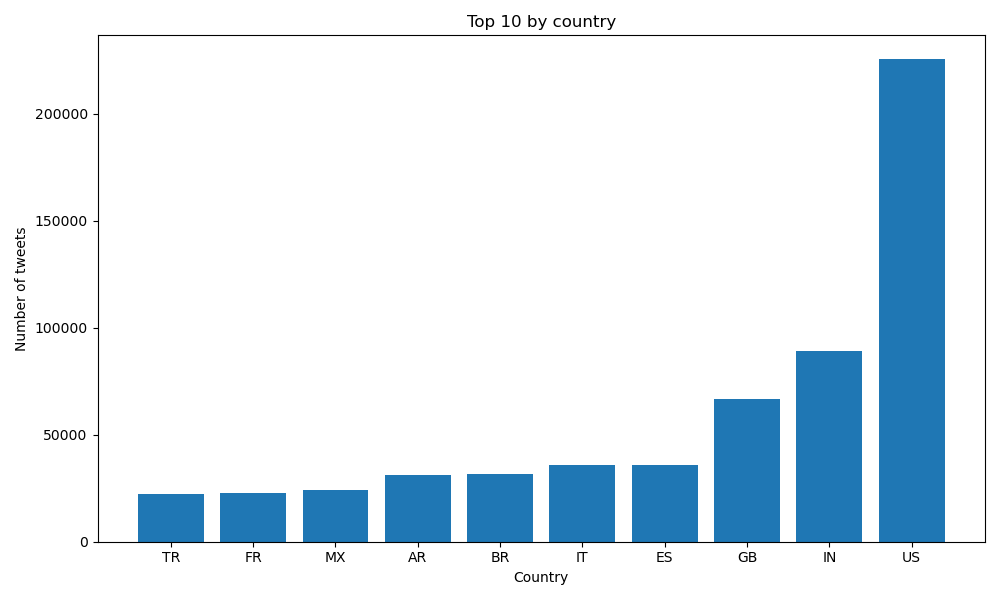
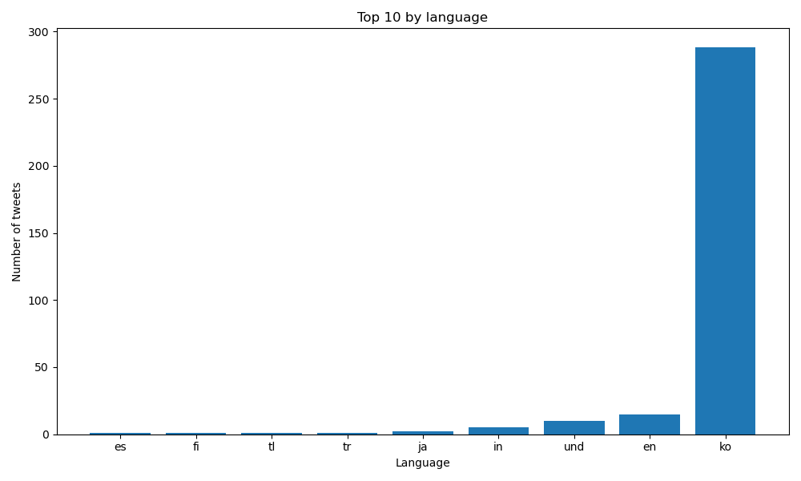
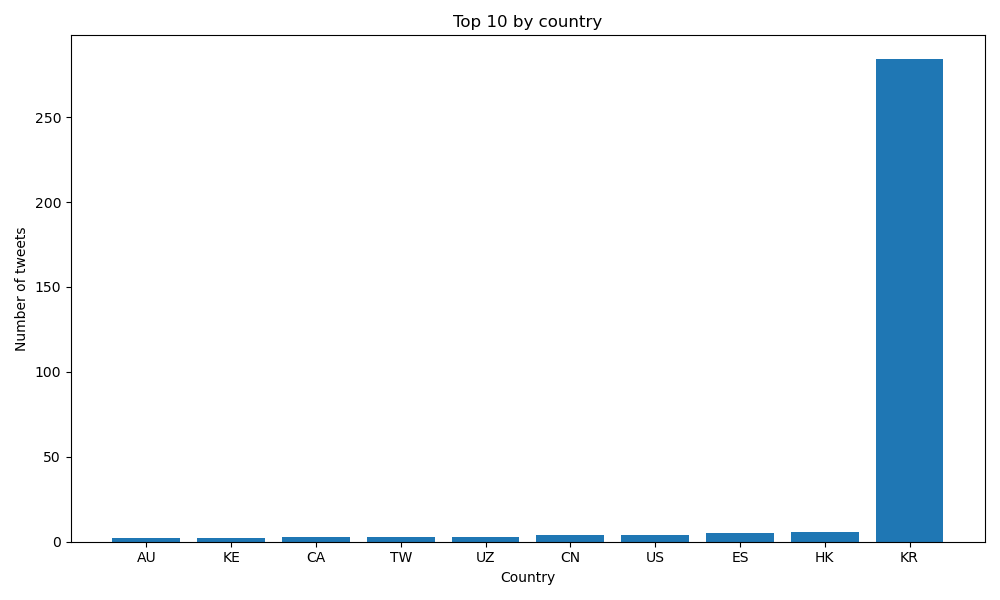
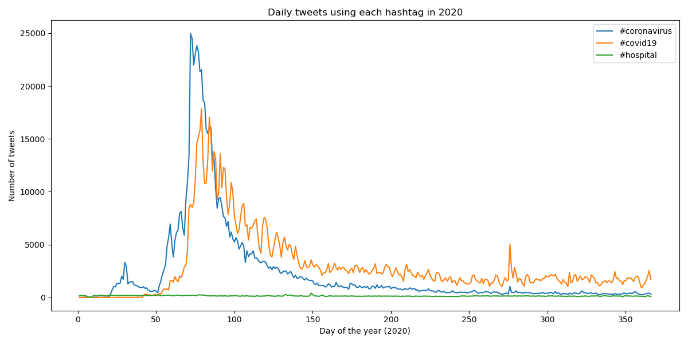

# Coronavirus twitter analysis

When Covid-19 started to gain prominence in early 2020, it is no surprise that people would start discusing it on platforms such as Twitter. This project looks at all geotagged tweets sent in the year 2020, and collects data on discussions regarding coronavirus and where these discussions are taking place from.

## How it works

We have 17 different hashtags that are related to covid-19

map.py parses one day of geotagged tweets and counts how often each of the 17 hashtags appears, broken down by the tweet's language and country

run_maps.sh parallel processes map.py. We thus run 366 map processes concurrently, one for each day of the year

reduce.py is the reduce step of the Mapreduce method that merges the 366 different output files (from each of the map processes) to get the results for the whole year.

visualize.py then plots the top 10 languages or countries under which any specific hashtags were used.

alternative_reduce allows us to see how usage of hashtags change over the course of the year.

## Plots

We plot the top ten languages under which we found the #coronavirus tag

We plot the top ten countries where tweets with #coronavirus tag were sent

We plot the top ten languages under which we found the #코로나바이러스 tag

We plot the top ten countries where tweets with #코로나바이러스 tag were sent

This is a plot that shows the daily usage of the hashtags: #covid19, #coronavirus, and #hospital

